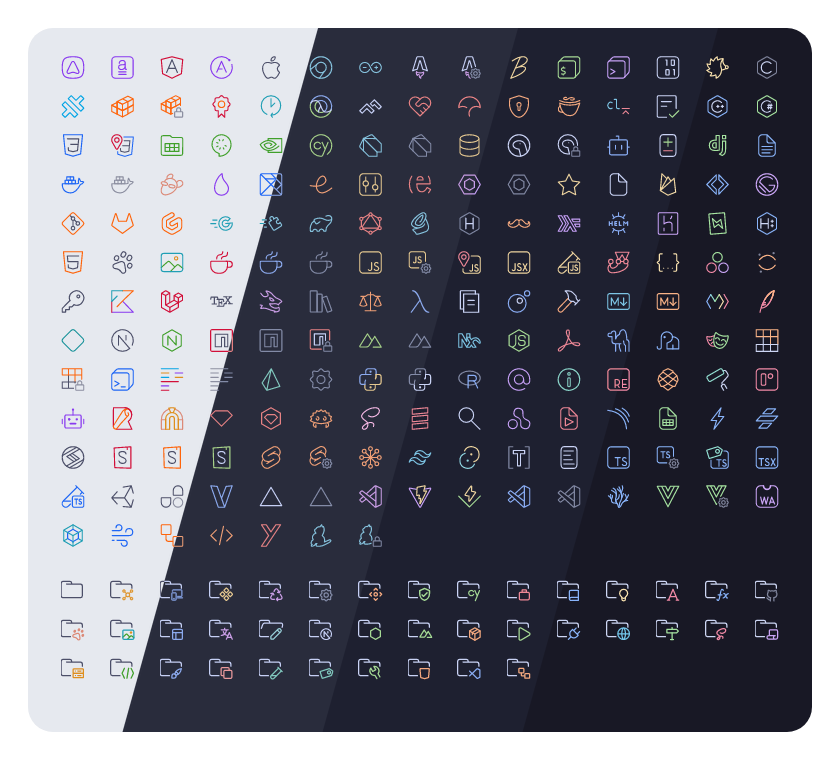
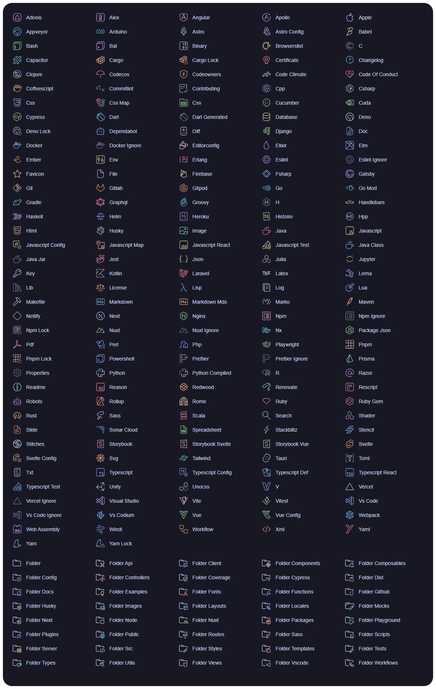

<h3 align="center">
	<br/>
	
	Catppuccin icons for <a href="https://github.com/leonardssh/vscord">VSCord</a>
	
</h3>

<p align="center">
	<a href="https://github.com/catppuccin/vscord/stargazers"></a>
	<a href="https://github.com/catppuccin/vscord/issues"></a>
	<a href="https://github.com/catppuccin/vscord/contributors"></a>
</p>

<p align="center">
	
</p>

## Previews

<details>
<summary>🌻 Latte</summary>

</details>
<details>
<summary>🪴 Frappé</summary>

</details>
<details>
<summary>🌺 Macchiato</summary>

</details>
<details>
<summary>🌿 Mocha</summary>

</details>

## Usage

1. Press <key>CTRL</key> + <key>Shift</key> + <key>P</key> or <key>CMD</key> + <key>Shift</key> + <key>P</key>
2. Type in `> Open User Settings (JSON)` and press enter
3. Paste this into the end of your settings

```json
{
  "vscord.status.image.large.viewing.key": "https://raw.githubusercontent.com/catppuccin/vscord/main/images/{{ YOUR FLAVOR }}/{lang}.png",
  "vscord.status.image.large.editing.key": "https://raw.githubusercontent.com/catppuccin/vscord/main/images/{{ YOUR FLAVOR }}/{lang}.png",
  "vscord.status.image.large.debugging.key": "https://raw.githubusercontent.com/catppuccin/vscord/main/images/{{ YOUR FLAVOR }}/{lang}.png",
  "vscord.status.image.large.idle.key": "https://raw.githubusercontent.com/catppuccin/vscord/main/images/{{ YOUR FLAVOR }}/{lang}.png",
  "vscord.status.image.large.notInFile.key": "https://raw.githubusercontent.com/catppuccin/catppuccin/main/assets/logos/exports/macchiato_square.png",
  "vscord.status.image.small.viewing.key": "https://raw.githubusercontent.com/catppuccin/vscord/main/images/{{ YOUR FLAVOR }}/{app_id}.png",
  "vscord.status.image.small.editing.key": "https://raw.githubusercontent.com/catppuccin/vscord/main/images/{{ YOUR FLAVOR }}/{app_id}.png",
  "vscord.status.image.small.debugging.key": "https://raw.githubusercontent.com/catppuccin/vscord/main/images/{{ YOUR FLAVOR }}/{app_id}.png",
  "vscord.status.image.small.idle.key": "https://raw.githubusercontent.com/catppuccin/vscord/main/images/{{ YOUR FLAVOR }}/{app_id}.png",
  "vscord.status.image.small.notInFile.key": "https://raw.githubusercontent.com/catppuccin/vscord/main/images/{{ YOUR FLAVOR }}/{app_id}.png"
}
```

4. Enjoy!

## 💝 Thanks to

- [PraZ](https://github.com/prazdevs)
- [xhayper](https://github.com/xhayper)

&nbsp;

<p align="center">
	
</p>

<p align="center">
	Copyright &copy; 2021-present <a href="https://github.com/catppuccin" target="_blank">Catppuccin Org</a>
</p>

<p align="center">
	<a href="https://github.com/catppuccin/catppuccin/blob/main/LICENSE"></a>
</p>
